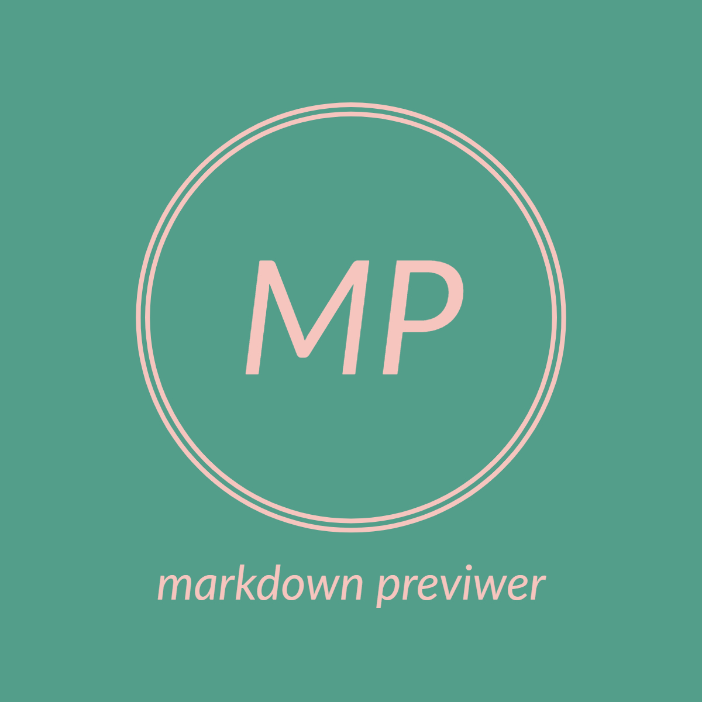

### Hi there 👋

<!--
**wangpin34/wangpin34** is a ✨ _special_ ✨ repository because its `README.md` (this file) appears on your GitHub profile.

Here are some ideas to get you started:

- 🔭 I’m currently working on ...
- 🌱 I’m currently learning ...
- 👯 I’m looking to collaborate on ...
- 🤔 I’m looking for help with ...
- 💬 Ask me about ...
- 📫 How to reach me: ...
- 😄 Pronouns: ...
- ⚡ Fun fact: ...
-->

Hi, my name is Penn Wang. 

Mainly programming on the web front end. In 2018, I started working for a team that focuses on k8s resource management and then get touched with technologies other than frontend, including Golang, Docker, ElasticSearch, and a bit of Kubernetes. I even created a CICD service ([Tekton](https://tekton.dev/) as the base) which was written in Golang.

Recently I am making extensions for Chrome. They are:

I also write at https://github.com/wangpin34/blog and https://dev.to/wangpin34.

### Coding Life

### Recent Activity

  

